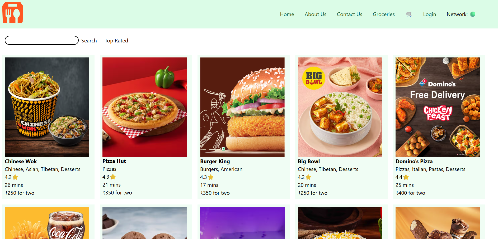

FoodVerse : All your food needs at one place 

echo "# FoodVerse" >> README.md
git init
git add README.md
git commit -m "first commit"
git branch -M main
git remote add origin https://github.com/nandini2399/FoodVerse.git
git push -u origin main

Swiggy API : https://www.swiggy.com/dapi/restaurants/list/v5?lat=21.99740&lng=79.00110&is-seo-homepage-enabled=true&page_type=DESKTOP_WEB_LISTING